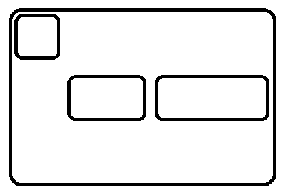

# @4react / flex

Flexbox components for React Applications.



```jsx
<Flex row justify="space-between" align="center">
  <FlexItem align="start">...</FlexItem>
  <FlexItem shrink grow >...</FlexItem>
  <FlexItem grow={2} >
    <Flex column align="center">
      <FlexItem>...</FlexItem>
      <FlexItem align="stretch">...</FlexItem>
      <FlexItem grow />
    </Flex>
  </FlexItem>
</Flex>
```

#### Install

```
npm i @4react/flex
```

## Flex
Generic `div` element with `display: flex`

```jsx
<Flex row justify="space-between" align="center">
  ...
</Flex>
```

| Prop | Type | Default | Description |
| --- | --- | --- | --- |
| inline | boolean | false | Transform in a `inline-flex` element. |
| direction | `'row'`, `'column'` | `'row'` | Define the main-axis of the container i.e. where the flex items are placed. Corresponding of the `flex-direction` property (along with the `reverse` prop). |
| row | boolean | false | Set the container main-axis to "horizontal". |
| column | boolean | false | Set the container main-axis to "vertical". |
| reverse | boolean | false | Reverse the container direction. |
| justify | `'start'`, `'end'`, `'center'`, `'space-between'`, `'space-around'`, `'space-evenly'` | `'start'` | Alignment of flex items along the main axis. Corresponding of the `justify-content` property. |
| align | `'stretch'`, `'start'`, `'end'`, `'center'`, `'baseline'` | `'stretch'` | Alignment of flex items along the cross axis on the current line. Corresponding of the `align-items` property. |
| lines | `'stretch'`, `'start'`, `'end'`, `'space-between'`, `'space-around'`, `'space-evenly'` | `'stretch'` | Alignment of lines (when there is extra space in the cross-axis). Corresponding of the `align-content` property. |
| wrap | boolean, `'reverse'` | false | Controls if (and how) items will flow across multiple lines. |
| className | string | - | Additional className for the component. |
| style | object | - | Additional style object for the component. |

#### Display
Description

```jsx
// display: flex
<Flex>

// display: inline-flex
<Flex inline>
```

#### Direction
Description.

```jsx
// row
<Flex>
<Flex row
<Flex direction="row">

// row-reverse
<Flex row reverse>
<Flex direction="row" reverse>

// column
<Flex column
<Flex direction="column">

// column-reverse
<Flex column reverse>
<Flex direction="column" reverse>
```

#### Justification
Description.

```jsx
// justify-content
<Flex justify="start">
<Flex justify="center">
<Flex justify="space-between">

// align-items
<Flex align="start">
<Flex align="stretch">
<Flex align="center">

// align-content
<Flex lines="start">
<Flex lines="center">
<Flex lines="space-between">
```

#### Wrap
Description.

```jsx
// nowrap
<Flex>

// wrap
<Flex wrap>

// wrap-reverse
<Flex wrap="reverse">
```

## Flexed

```jsx
<Flexed grow order={2} />
```
